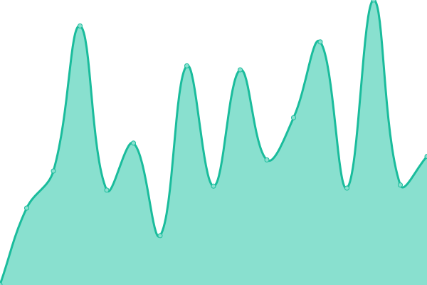

# [📈 Live Status](https://status.opott.uk): <!--live status--> **🟩 All systems operational**

This repository contains the open-source uptime monitor and status page for [Oliver Potter](https://status.opott.uk),

<!--start: status pages-->
<!-- This summary is generated by Upptime (https://github.com/upptime/upptime) -->
<!-- Do not edit this manually, your changes will be overwritten -->
<!-- prettier-ignore -->
| URL | Status | History | Response Time | Uptime |
| --- | ------ | ------- | ------------- | ------ |
|  [Splash](https://opott.uk) | 🟩 Up | [splash.yml](https://github.com/opott/status/commits/HEAD/history/splash.yml) | 

 500ms
     
 | 

<a href="https://status.opott.uk/history/splash">100.00%</a>
    

|  [Portfolio](https://portfolio.opott.uk) | 🟩 Up | [portfolio.yml](https://github.com/opott/status/commits/HEAD/history/portfolio.yml) | 

 501ms
     
 | 

<a href="https://status.opott.uk/history/portfolio">100.00%</a>
    

|  [Status Page](https://status.opott.uk) | 🟩 Up | [status-page.yml](https://github.com/opott/status/commits/HEAD/history/status-page.yml) | 

 191ms
     
 | 

<a href="https://status.opott.uk/history/status-page">100.00%</a>
    

|  [CourseNotes](https://notes.opott.uk) | 🟩 Up | [course-notes.yml](https://github.com/opott/status/commits/HEAD/history/course-notes.yml) | 

 461ms
     
 | 

<a href="https://status.opott.uk/history/course-notes">100.00%</a>
    

<!--end: status pages-->

[**Visit my status website →**](https://status.opott.uk)

## 📄 License

- Powered by: [Upptime](https://github.com/upptime/upptime)
- Code: [MIT](./LICENSE) © [Anand Chowdhary](https://anandchowdhary.com), supported by [Pabio](https://pabio.com)
- Data in the `./history` directory: [Open Database License](https://opendatacommons.org/licenses/odbl/1-0/)
